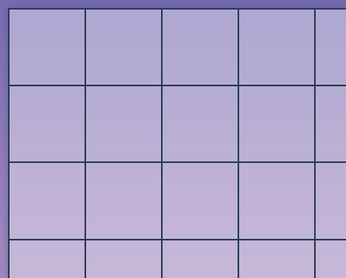
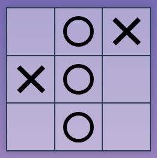
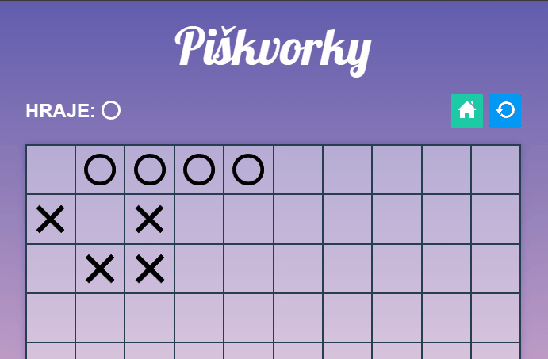
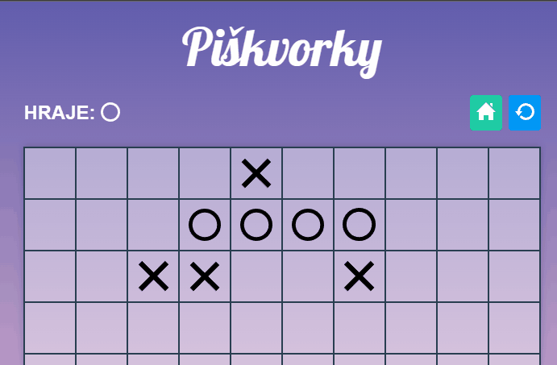
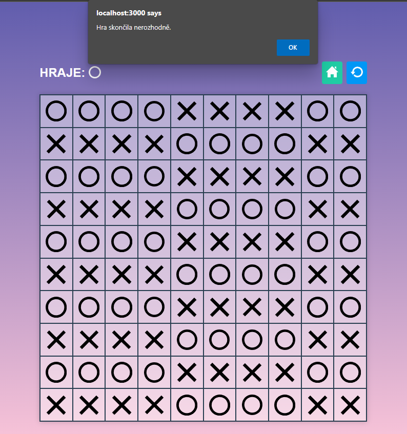
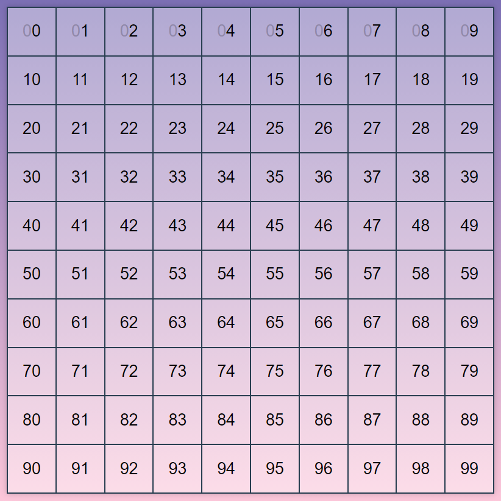

# Úkol: Piškvorky 4/5

Tento úkol navazuje na [Piškvorky 3](https://github.com/Czechitas-podklady-WEB/ukol-piskvorky-3). Tentokrát oživíš i všech zbylých 90 políček a přidáš detekci výhry.

## Zadání

1.  Pokračuj v repozitáři `piskvorky` z předchozích úkolů.

1.  Nastav posluchač události všem políčkům.

    1.  Vyber všechna políčka pomocí `document.querySelectorAll`.

    1.  Metodou `forEach` je všechny projdi a přidej jim posluchač události na kliknutí. Zařiď, aby kliknutí zavolalo funkci, kterou máš nachystanou z předchozího úkolu.

    1.  Původních deset posluchačů smaž. Nejsou díky předchozímu kroku již potřeba.

    1.  Oveř si, že nyní hra reaguje na kliknutí na všechna políčka.

        

1.  Po každém tahu ověř, jestli někdo nevyhrál. Využij již hotovou funkci `findWinner` od cizího autora.

    1.  Do tvého javascriptu zapoj funkci `findWinner`. Na první řádek, úplně na začátek tvého javascriptového souboru přidej následující kód.

        ```js
        import { findWinner } from 'https://unpkg.com/piskvorky@0.1.4'
        ```

        To ti umožní používat funkci `findWinner` v tvém kódu.

        Import výše musí být opravdu na prvním řádku tvého javascriptového souboru a v HTML souboru ti u načítání javascriptu nesmí chybět `type="module"`. Jinak načtení funkce selže.

        Funkce `findWinner` očekává jeden vstupní parametr, pole řetězců `'x'` pro křížek, `'o'` pro kolečko a `'_'` pro neobsazené políčko.
        Pole tedy v sobě bude mít 100 prvků (textových řetězců vždy s jendím znakem).
        Začíná se v levém horním políčku a postupuje se po prvním řádku doprava.
        Na konci řádku se přeskkočí na první políčko druhého řádku (to tedy bude v poli na 11. místě, s indexem `10`), až poslední prvek pole s indexem `99` bude obsahovat políčko úplně vpravo dole.
        Zpátky po zavolání vrací, kdo vyhrál.

        ### Návratové hodnoty funkce `findWinner`:

        - `'x'` - vyhrál hráč s křížky
        - `'o'` - vyhrál hráč s kolečky
        - `null` - hra ještě neskončila, zatím nikdo nevyhrál
        - `'tie'` - hra skončila remízou

        ### Ukázka použití:

        Inspiruj se níže zjednodušenou hrou 3x3:

        ```js
        const herniPole = ['_', 'o', 'x', 'x', 'o', '_', '_', 'o', '_']
        const vitez = findWinner(herniPole)
        if (vitez === 'o' || vitez === 'x') {
        	alert(`Vyhrál hráč se symbolem ${vitez}.`) // Vyhrál hráč se symbolem 'o' nebo 'x'.
        }
        ```

        To stejné herní pole lze pro lepší přehlednost zapsat i takto:

        <!-- prettier-ignore -->
        ```js
        const herniPole = [
        	'_', 'o', 'x',
        	'x', 'o', '_',
        	'_', 'o', '_',
        ]
        ```

        První tři prvky odpovídají prvnímu řádku. Druhé tři druhému. Třetí třetímu.

        

    1.  Po každém tahu projdi všech sto políček a vytvoř z nich pole vhodné pro funkci `findWinner`. Podobu pole si můžeš ověřit vypsáním do vývojářské konzole. Mělo by mít sto položek a obsahovat jen řetězce `'x'`, `'o'` a `'_'`. Prvních deset položek by mělo odpovídat prvnímu řádku podobně jako u varianty 3x3.

    1.  Pole předej funkci `findWinner`.

    1.  Pokud ti vrátí, že vyhrál křížek nebo kolečko, zobraz uživateli zprávu o výherci pomocí funkce `alert`. Návratové hodnoty `null` a `'tie'` ignoruj.

    1.  Po tom, co uživatel odklikne `alert`, přenačti stránku voláním zabudované funkce `location.reload()`, která přenačte stránku, aby uživatel mohl začít novou hru.

        

    1.  Zkus odehrát pár her a ověřit, že tvůj kód správně pozná výhru křížku i kolečka.

## Bonus

- Pokud se ti poslední symbol nestíhá na obrazovce včas zobrazit, pozdrž zobrazení `alert` hlášky pomocí časovače.

  

- Pokud hra skončila remízou, zobraz o tom uživateli zprávu.

  

## Super bonus
Funkce `findWinner`, kterou importujete, vám usnadní práci. Ale není to žádná magie, se současnými znalostmi už ji zvládnete napsat také. Takže pokud chcete, odstraňte z kódu import funkce `findWinner` a napište si ji samy!

Hodit se k tomu bude [cyklus for](https://kodim.cz/czechitas/daweb/js1/pole-data/cteni-na-doma). Obvykle je cyklus `for` na psaní zdlouhavější, než metoda `forEach` – proto obvykle dáváme přednost `forEach`. `forEach` ale neumí jednu věc – předčasné ukončení. ¨forEach` vždycky projde celé pole, ať se děje co se děje.
Naproti tomu `for`, který máme ve funkci můžeme ukončit pomocí _předčasného návratu_ (_early return_) – když usoudíme, že pole už dál procházet nepotřebujeme, prostě pomocí `return` z funkce vyskočíme, a tím se přeruší i cyklus, který jsme měli v té funkci _rozjetý_.

No a k čemu je to dobré? Jak už vás asi napadlo, vítěze budeme hledat pomocí procházení pole. A když už vítěze najdeme, je zbytečné procházet pole dál – pokud nemáme v programu chybu, vítěz je jenom jeden a nic zajímavého už v tom poli nenajdeme.

Nejprve si ale připomeňme, jak vypadá hrací pole – je reprezentováno polem se 100 prvky. Indexy pole promítnuté do hrací plochy vypadají takto:



Následuje popis, jak na to. K popisu by se hodila spousta obrázků – ale ty si raději nakreslete samy (podle vzoru výše), lépe vám to pomůže o problému přemýšlet. Takže si k ruce vemte čtverečkovaný papír a tužku, a směle do toho.

### Hledání vítěze – z jednoho velkého problému udělejme čtyři menší
Jak tedy na hledání vítěze? Vítěz je ten, kdo udělá 5 stejných symbolů za sebou – v řádku, ve sloupci, nebo diagonálně v v jednom či druhém směru. Hledat vítěze rovnou ve všech čtyřech směrech by bylo komplikované. Proto si to rozdělíme na menší úlohy.

Zvlášť budeme hledat, zda nemáme v jednom řádku 5 stejných symbolů. Napíšeme si na to malou funkci. Druhou malou funkci si napíšeme na hledání vítěze ve sloupci. Další funkci budeme mít pro diagonální hledání zleva nahoře vpravo dolů, a čtvrtá funkce bude hledat zleva dole doprava nahoru.

Celková funkce na určení vítěze pak zavolá funkci pro hledání v řádku. Když ta vrátí vítěze, máme celkového vítěze. Pokud vítěze nevrátí, budeme stejným způsobem pokračovat druhou funkcí a tak dále, dokud buď nebudeme mít vítěze, nebo neprojdeme všechny čtyři funkce bezvýsledně.

Pokud ani jedna z funkcí nevrátí vítěze, znamená to, že hra buď dále pokračuje, nebo jsou všechna políčka zaplněná bez vítěze – pak je to remíza. Pokud tedy nemáme na konci vítěze, projdeme ještě úplně všechna políčka a zjistíme, zda je některé volné (obsahuje `'_'`). Pokud ano, hra pokračuje. K tomu se bude hodit metoda [some()](https://developer.mozilla.org/en-US/docs/Web/JavaScript/Reference/Global_Objects/Array/some). (Proč neprojdeme všechna políčka hned na začátku, před zjišťováním vítěze? I ten úplně poslední tah, který zaplnil celé hrací pole, mohl být vítězný. Takže nejprve musíme zjistit, zda někdo nevyhrál, a teprve pokud ne, můžeme uvažovat o remíze.)

### Hledání vítěze v řádcích
Začneme tedy funkcí, která zjistí, zda někdo nevyhrál v některém řádku. Ta bude velmi jednoduchá – zavoláme desátkrát za sebou (pomocí cyklu!) funkci, která zjistí, zda někdo nevyhrál v jednom konkrétním řádku. Vždy otestujeme výsledek, zda někdo vyhrál – pokud ano, ukončíme funkci a vrátíme z ní informaci o vítězi (`'x'` nebo `'o'`).

No jo, ale k tomu potřebujeme funkci, která zjistí, zda někdo vyhrál v zadaném řádku. Tato funkce bude očekávat jeden parametr – index políčka, na kterém daný řádek začíná. Takže ji nejprve zavoláme s `0` pro 1. řádek, pak s `10` pro 2.  řádek atd. až do `90`.

A jak bude samotná funkce pro zjištění vítěze v jendom řádku vypadat? Zavedem si dvě pomocné proměnné (budou se v průběu funkce měnit). V jedné budeme mít kandidáta na vítěze – pokud budeme mít podezření, že to teď vypadá dobře pro kolečko a mohlo by vyhrát, uložíme si tam `'o'`. Pokud to vypadá nadějně pro křížek, uložíme si tam `'x'`. A pokud to nevypadá dobře ani pro jednoho, dáme tam `null`. A kdo bude ten kandidát na vítěze? Bude to ten, jehož symbol jsme naposledy viděli při procházení řádku. Dále si zavedem ještě jednu pomocnou proměnnou, ve které si budeme pamatovat, kolik symbolů v řadě jsme už viděli (takovým proměnným, ve kterých počítáme počet výskytů, se říká _čítač_ nebo _counter_). Na začátku ot bude `0`.

Budeme postupně v cyklu procházet celý řádek. Začneme na indexu, který jsme dostali jako parametr na vstupu funkce – ten nám říká, na kterém indexu v poli reprezentujcím hrací plochu máme začít. Nesmíme zapomenout, že jeden řádek má jenom 10 políček – to bude maximální počet obrátek cyklu, které můžeme v této funkci provést.

Představme si, jak to bude vypadat pro 1. řádek. Začínáme na indexu 0, tedy úplně vlevo nahoře. Kandidát na výhru je `null`, počet symbolů v řadě `0`. Podíváme se, jaký symbol je v aktuálním políčku. Pokud je to `'_'`, znamená to, že tam nikdo nehrál. Takže kandidáta na výhru nastavíme na `null` a počet symbolů v řadě na `0`. Že už to tak bylo? Nevadí, pro počítač je to minimum práce a nám to výrazně ulehčí kód, protože to samé pak budeme dělat i s následujícími políčky.

Pokud je v aktuálním políčku `'x'` nebo `'o'`, znamená to, že už tam někdo hrál. Porovnáme symbol v políčku s aktuálním kandidátem na výhru. Pokud se shodují, znamená to, že náš kandidát na výhru má další políčko v řadě. Takže náš _čítač_ počítající, kolik stejných symbolů v řadě jsme už viděli, zvětšíme o jedničku. A možná to byl už pátý symbol v řadě – takže ověříme, zda čítač nemá hodnotu 5. Pokud ano, známe vítěze! Náš kandidát na vítěze je skutečný vítěz, takže jeho symbol pomocí `return` vrátíme z naší funcke. Pokud se hodnoty mezi aktuálním políčkem a kandidátem na vítěze neshodují, znamená to, že protihráč našemu kandidátovi na vítěze překazil slibnou řadu, nebo že zatím žádného kandidáta na vítěze nemáme. V obou případech tedy kandidáta na vítěze nastavíme na symbol v aktuálním políčku a čítač nastavíme na `1`.

A to je skoro vše. Pokud v daném řádku někdo vyhrál, dospěje čítač až k hodnotě `5` a vítěze vrátíme z funkce. Teď už zbývá jen ošetřit situaci, kdy nikdo v tomto řádku nevyhrál. V takovém případě cyklus doběhne až do konce a po skončneí cyklu z funkce vrátíme `null`.

Můžeme do funkce přidat ještě drobnou optimalizaci. Pokud by se nám kandidát na vítěze změnil na 7. políčku (tedy index 6) nebo později, už víme, že nikdy nemůže vyhrát – zbývá mu v řádku už jen méně než 5 políček. V takovém případě můžeme funkci také rovnou ukončit s tím, že v daném řádku není vítěz.

### Hledání vítěze ve sloupcích
Podobným způsobem napíšeme i funkci pro zjištění, zda někdo nevyhrál v některém ze sloupců, která bude volat funkci, která zjistí, zda někdo nevyhrál v zadaném sloupci. Rozdíl bude jenom v tom, že funkce pro všechny sloupce zavolá funkci pro jeden sloupec pro jednotlivé sloupce, tedy pro políčka `0`, `1`, `2` až `9`. A funkce zjišťující výhru v jednom konkrétním sloupci bude _poskakovat_ vždy po 10 políčkách pole – pokud začne na `0`, další políčko bude `10`, další `20` atd.

### Hledání vítěze v diagonálách
S diagonálami to bude trošku složitější. Začněme s diagonálami které začínají vlevo nahoře a jdou směrem doprava dolů. A ještě si to rozdělíme na dvě části. Zvlášť budeme řešit hlavní diagonálu (z políčka `0` do políčka `99`) a všechny diagonály, kteréjou jsou vpravo nahoře od ní. A zvlášť vyřešíme trojúhelník vlevo dole.

Pro první část (hlavní diagonála a trojúhelník vpravo nahoře) budeme volat pomocnou funkci, která prověří jednu diagonálu. Funkci tedy předáme začátek diagonály, tedy nejprve `0`, pak `1` – teoreticky až do `9`. Jenže trojúhelníček úplně vpravo nahoře nás nezajímá – tam už jsou diagonály příliš krátké, 4 a méně políček, tam diagonální výhra nikdy nastat nemůže. Takže poslední diagonála, kterou budeme testovat, bude ta začínající v políčku s indexem 5.

Funkce pro ověření jedné diagonály bude fungovat podobně, jako funkce pro ověření jednoho řádku nebo sloupce. Akorát tentokrát budeme po poli reprezentujícím hrací pole _poskakovat_ po 11 indexex – přičtením 10 se posuneme na další řádek ve stejném sloupci, přičtením další 1 se posuneme ještě o sloupec vpravo.

Problém je, kde skončit. Když začneme třeba na indexu `5`, doskáčeme postupně na indexy `16`, `27`, `38`, `49`. Když si to namalujete na čtverečkovaný papír, uvidíte, že tím jsme narazili na okraj hrací plochy. Jenže nám nic nebrání přičíst dalších `11` a pokračovat na políčku `60`. Což je špatně – a narazili jsme na chybu, ke ketré dochází v programováí často, a říká s ejí _přetečení_ (_overflow_). Jak z toho ven? Když se podíváte na henrí plochu, uvidíte, že všechny diagonály v pravém horním otrjúhelníku končí vždy na indexu s 9 na konci. Podle toho dokážeme poznat, že už nemáme pokračovat – spočítáme zbytek po dělení indexu `10` a pokud vyjde `9`, víme, že v této diagonálu už nebudeme pokračovat.

Druhá část (zbývající trojúhelník vlevo dole), bude podobná. Jenom budou počáteční indexy postupovat po řádcích – začneme na `10`, pak `20`. Poslední bude `50!, protože diagonála začínající na indexu `60` už je zase moc krátká, má jen 4 políčka.

Velmi podobná bude i pomocná funkce, která bude ověřovat vítězství v jedné diagonále. Opět bude _poskakovat_ po 11 indexech, lišit se ale bdue způsob, jak poznáme, že jsme na konci diagonály. Tentokrát bude diagonála vždy končit na poslendím řádku – tedy index bude větší nebo roven `90`.

A to je vše pro tento směr diagonál, nyní už dokážeme zjistit i vítěze na všech diagonálách vedoucích zleva nahoře vpravo dolů.

Zbývají diagonály vedoucí zprvaa nahoře doleva dolů. Princip bude podobný, jako u předchozího směru diagonál. Akorát budeme _poskakovat_ jen o 9 indexů – posunem o 10 se přesuneme na následující řádek v stejném sloupci, ale pak musíme odečíst 1, abychom se vrátili o políčko doleva. Jiné bude také testování konce diagonál – ale na to už s pomocí obrázků na čtverečkovaném papíře určitě přijdete samy.
